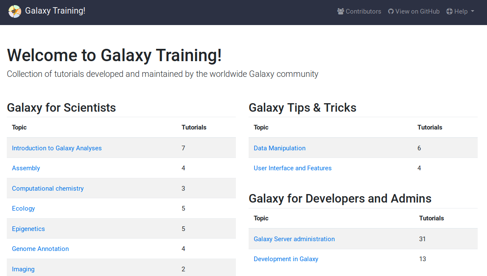

### Galaxy Workshop Setup

 <!-- .element width="60%" -->

(These slides can be accessed via: <a href="https://tinyurl.com/GalaxyWorkshop">tinyurl.com/GalaxyWorkshop</a>)

---
## Let's get started!

 

These slides will help you to:

1. Log in to Galaxy
2. Join the training priority queue
3. Find the Training Manual

  

(These slides can be accessed via: <a href="https://tinyurl.com/GalaxyWorkshop">tinyurl.com/GalaxyWorkshop</a>)

---
## Logging into Galaxy

1. Open Galaxy: [https://usegalaxy.eu](https://usegalaxy.eu)

2. Log in to Galaxy (top right)

3. No account yet? Register (top right)
  - Verify your registration (e-mail confirmation)

  

(These slides can be accessed via: <a href="https://tinyurl.com/GalaxyWorkshop">tinyurl.com/GalaxyWorkshop</a>)

---
## Joining the Training

 

1. Open [https://usegalaxy.eu/join-training/NGSdiagnostics](https://usegalaxy.eu/join-training/NGSdiagnostics])
2. You should see a green confirmation box
3. You will now have access to
   - dedicated compute resources
   - shorter waiting times \o/

  

(These slides can be accessed via: <a href="https://tinyurl.com/GalaxyWorkshop">tinyurl.com/GalaxyWorkshop</a>)

----

## TIaaS

UseGalaxyEU offers Training Infrastructure as a Service (TIaaS)

<!-- .element width="50%" -->

- No need to setup Galaxy
- Participants get a private queue (shorter waiting times)

  

(These slides can be accessed via: <a href="https://tinyurl.com/GalaxyWorkshop">tinyurl.com/GalaxyWorkshop</a>)

---

## Training Manual

 

1. Navigate to [training.galaxyproject.org](https://training.galaxyproject.org)
2. Topic: **Introduction to Galaxy Analyses**
3. Tutorial: **Galaxy 101** (Hands-on)

 <!-- .element width="50%" -->

(These slides can be accessed via: <a href="https://tinyurl.com/GalaxyWorkshop">tinyurl.com/GalaxyWorkshop</a>)

